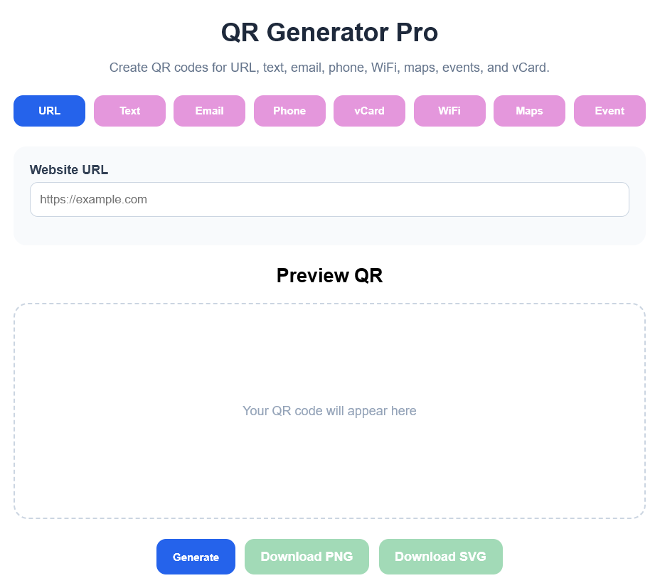
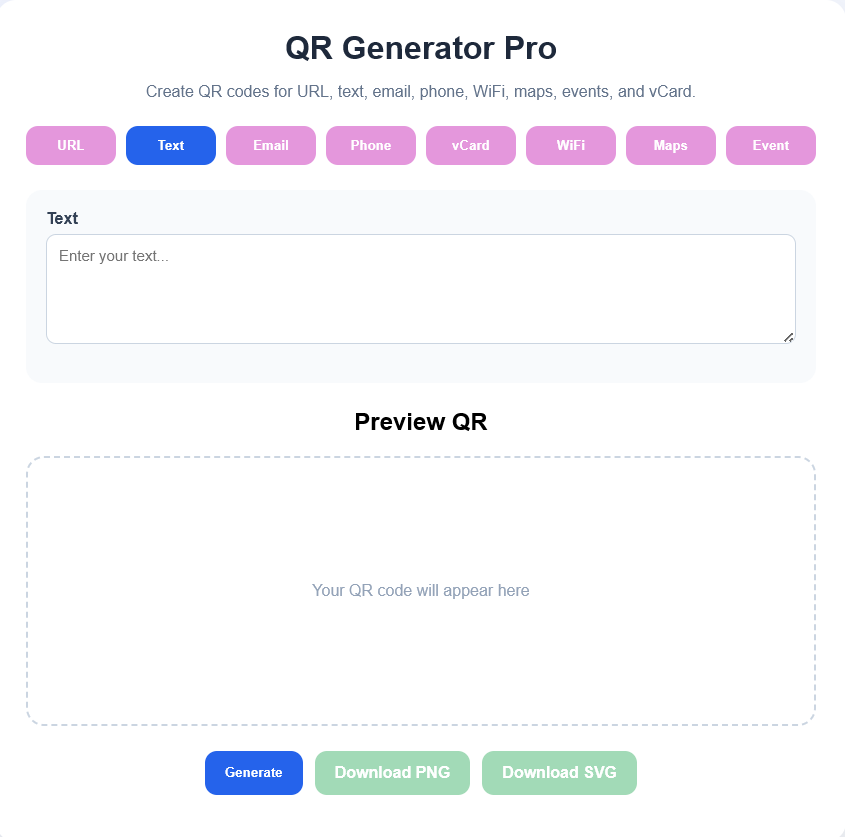
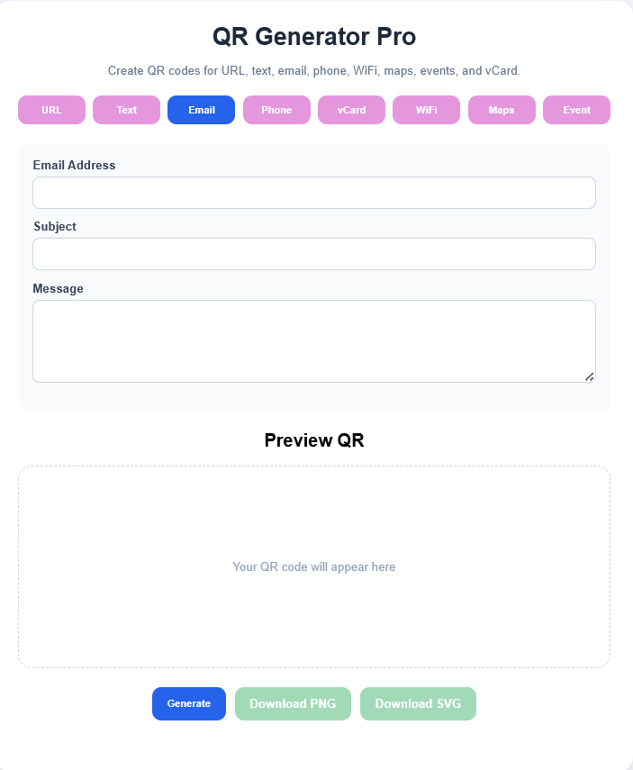
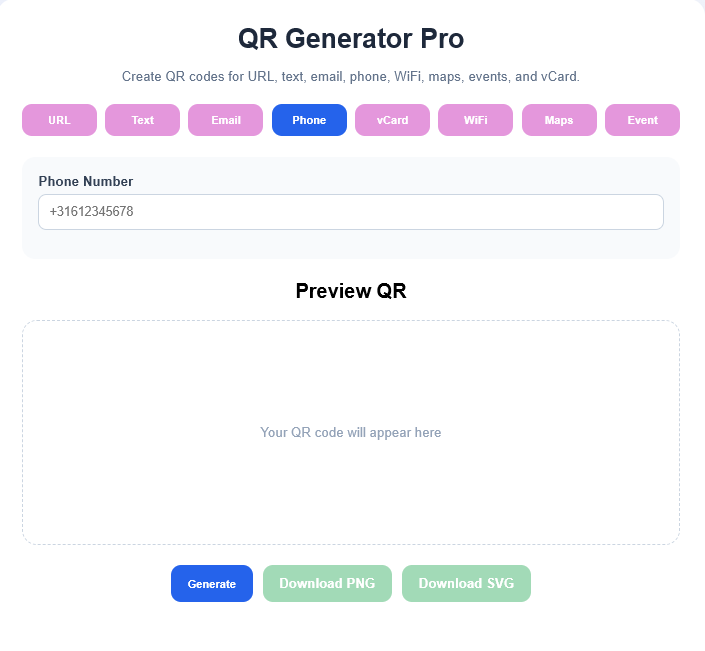
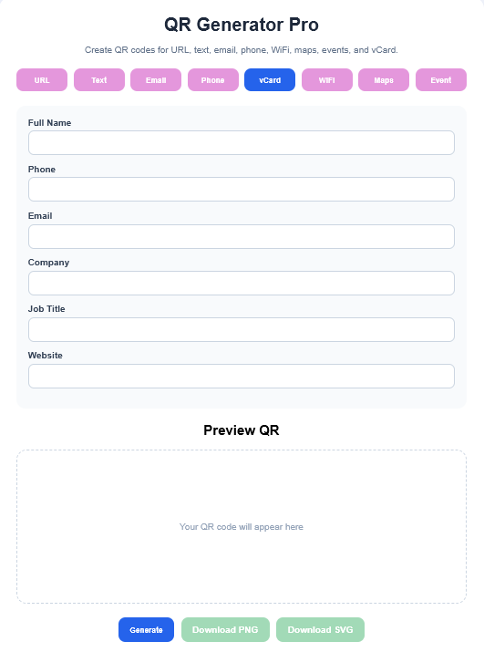
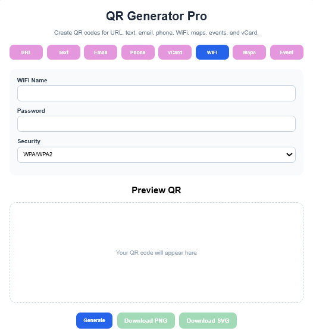
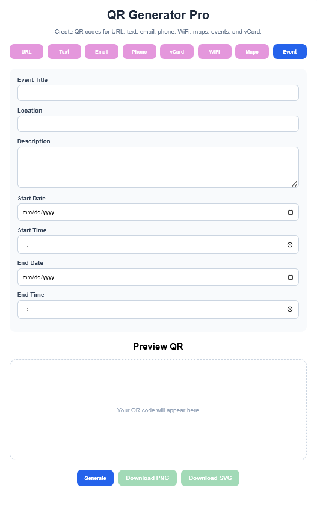

# QR Generator Pro

A modern and powerful QR Code Generator built with **Python**, **Flask**, **HTML**, **CSS**, and **JavaScript**.

Generate multiple types of QR codes instantly, preview them in real time, and download them as **PNG** or **SVG** files.

---

## ✨ Features

### 🌐 URL QR Code

Convert any website link into a QR code that opens directly in a browser when scanned.

✅ Perfect for:

* Business websites
* Online portfolios
* Product pages
* Social media profiles

📸 **Example**



---

### 📝 Text QR Code

Store plain text inside a QR code. The text is displayed immediately when scanned.

✅ Perfect for:

* Notes
* Instructions
* Product information
* Educational materials

📸 **Example**



---

### 📧 Email QR Code

Create QR codes that automatically open an email draft with predefined recipient, subject, and message.

✅ Perfect for:

* Customer support
* Contact forms
* Feedback requests
* Business communication

📸 **Example**



---

### 📞 Phone QR Code

Generate QR codes that instantly start a phone call when scanned on a mobile device.

✅ Perfect for:

* Business cards
* Customer service
* Emergency contacts
* Sales teams

📸 **Example**



---

### 👤 vCard QR Code

Create a digital business card and allow users to save your contact information with a single scan.

Includes:

* Full Name
* Phone Number
* Email Address
* Company
* Job Title
* Website

📸 **Example**



---

### 📶 WiFi QR Code

Let users connect to your WiFi network instantly without typing passwords.

Supports:

* WPA / WPA2
* WEP
* Open Networks

📸 **Example**



---

### 📍 Maps QR Code

Generate QR codes linked to Google Maps locations.

Perfect for:

* Offices
* Shops
* Restaurants
* Event locations

📸 **Example**


---

### 📅 Event QR Code

Allow users to add events directly to their calendar by scanning a QR code.

Includes:

* Event Title
* Location
* Description
* Start Date
* End Date

📸 **Example**




## 🔥 Why Use QR Generator Pro?

✔ Completely customizable

✔ Open Source

✔ No subscriptions

✔ No monthly fees

✔ No hidden limitations

✔ No account required

✔ PNG & SVG export support

✔ Easy to deploy locally

✔ Built entirely with Python and Flask

---

## 🛠️ Technologies Used

* Python
* Flask
* HTML5
* CSS3
* JavaScript
* qrcode
* Pillow
* Segno

---

## 📂 Project Structure

```text
qr_generator/
├── app.py
├── uploads/
├── generated/
├── templates/
│   └── index.html
├── static/
│   ├── css/
│   │   └── style.css
│   ├── js/
│   │   └── app.js
│   └── logos/
└── requirements.txt
```

---

## 🎯 Getting Started

```bash
git clone https://github.com/yourusername/qr_generator.git

cd qr_generator

pip install -r requirements.txt

python app.py
```

Open:

```text
http://127.0.0.1:5000
```

---

## ❤️ Final Words

Tired of QR code websites that:

❌ Require subscriptions

❌ Lock features behind paywalls

❌ Limit downloads

❌ Add watermarks

❌ Ask you to create an account

Then this project is for you.

**QR Generator Pro** gives you complete freedom to generate QR codes locally on your own machine.

No monthly payments.

No restrictions.

No surprises.

Just clone it, run it, customize it, and enjoy.

> "Own your tools instead of renting them."

Happy coding! 🚀✨
